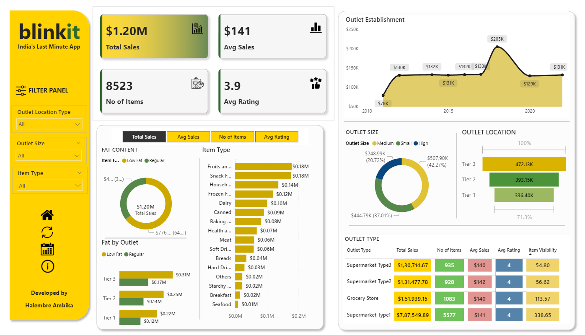

# Blinkit Sales Dashboard 📊

This Power BI dashboard presents a detailed analysis of Blinkit's sales data across outlet types, sizes, and locations.

---

## 📌 Key Features

- 💰 **Total Sales**: $1.20M across all outlets
- 📦 **No. of Items**: 8,523 unique items sold
- ⭐ **Average Rating**: 3.9
- 📍 **Outlet Filters**: Location, Size, and Item Type filters on left panel
- 📈 **Outlet Establishment Trends** over the years
- 🍞 **Item Type Breakdown** by sales and fat content

---

## 🔍 Insights Covered

- **Top performing outlet tiers** (Tier 3 leads with $472.13K in sales)
- **Sales contribution** from Low Fat vs Regular items
- **Outlet performance** by size, type, and location
- **Detailed comparison table** with KPIs across outlet types

---

## 🛠️ Tools Used

- Power BI Desktop
- DAX Measures
- Custom visuals (Donut charts, slicers, KPI cards)
- Data Modeling

---

## 📂 Files Included

- `Blinkit_Sales_Insights.pbix`: Power BI file
- `dashboard_preview.png`: Screenshot of the final dashboard

---

## 🧠 How to Use

1. Clone or download the repo.
2. Open `Blinkit_Sales_Insights.pbix` in Power BI Desktop.
3. Explore visuals, interact with filters, and modify data if needed.

---

## 👨‍💻 Developed By

Halembre Ambika

